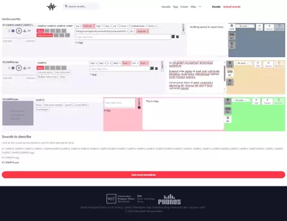

# freesound-compact-describe-sounds
Describe sounds vertically, not horizontally

## How to get

1. Install Tampermonkey, Violentmonkey or Greasemonkey. (Only tested with Tampermonkey)
2. Install [freesound-compact-describe-sounds.user.js](https://github.com/qubodup/freesound-compact-describe-sounds/raw/refs/heads/main/freesound-compact-describe-sounds.user.js)

## What it does

The uploaded sound file description form will look compact like this:  
  
which includes a tag counter and duplicate warning

instead of like this:  

